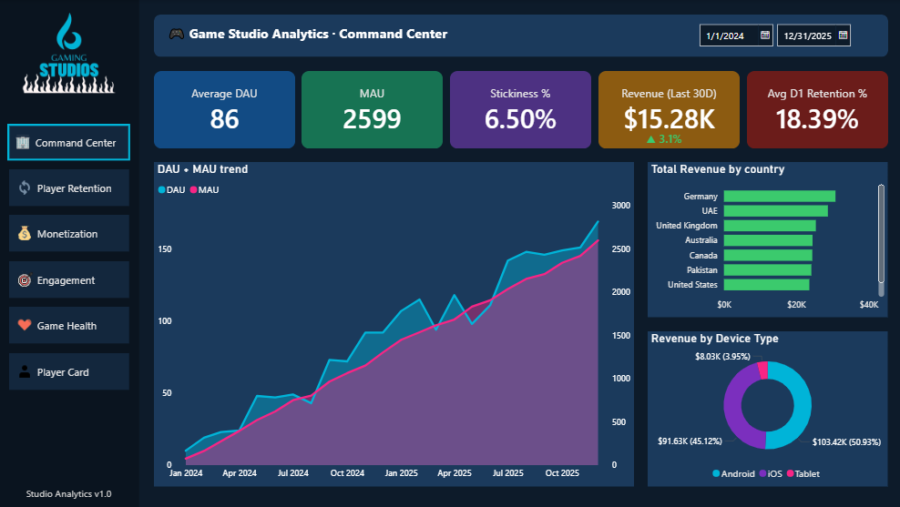
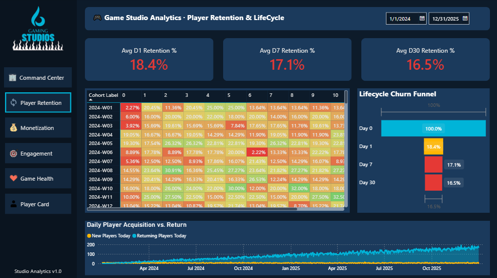
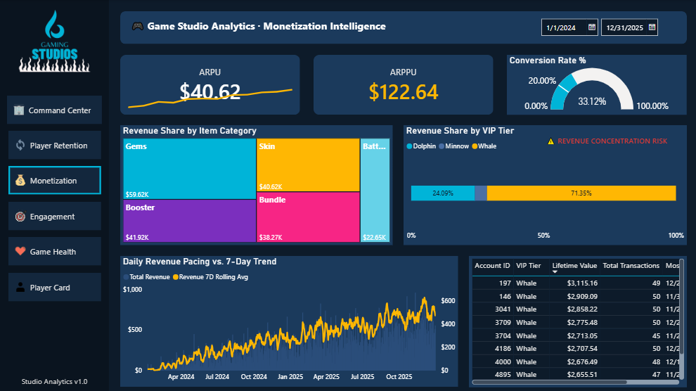
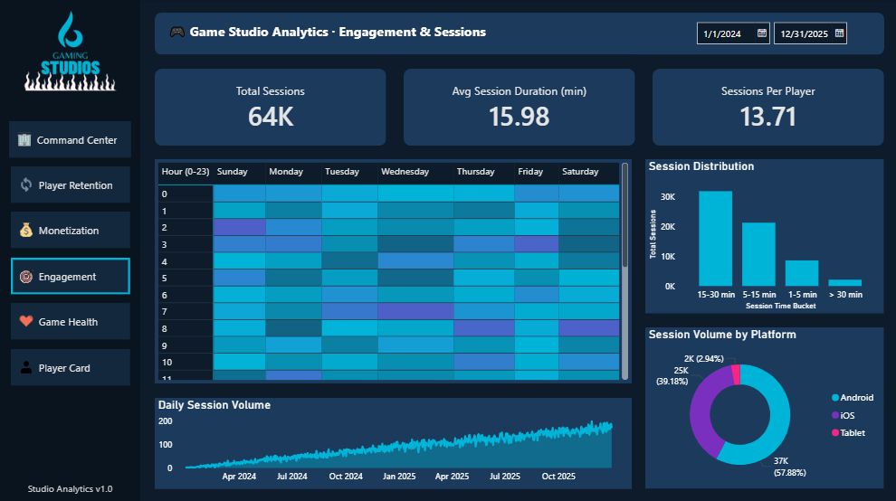
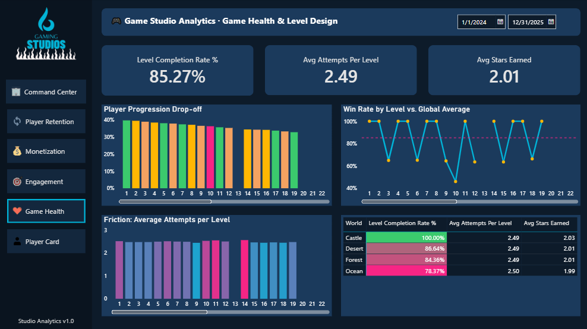
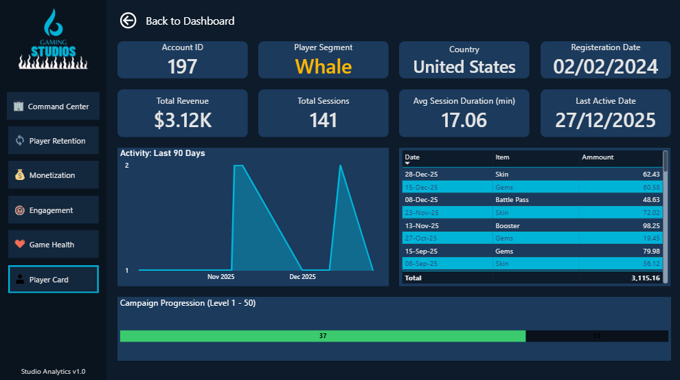

# 🎮 Mobile Game Studio Analytics Dashboard
**Power BI · PostgreSQL · DAX · 6-Page Interactive Dashboard**

## Business Context
This project is built from the perspective of a Head of Analytics at a mobile game studio. Leveraging past experience in game development (Ultra Edge Studios, 2021-2023), this dashboard is engineered to answer the exact operational and financial questions a studio CEO asks daily.

## 🎯 Core Business Questions Answered
* **Growth vs. Churn:** Is our game growing or declining? (DAU/MAU stickiness, Cohort Retention)
* **Friction Points:** Where in the game loop are players giving up? (Level drop-off funnels)
* **Economy Balance:** Which top-tier players drive the majority of our revenue? (Whale segmentation analysis)
* **Live-Ops Timing:** When are players most active? (Hour × Day activity heatmaps)
* **Monetization UX:** Is our pricing converting free players? (Free-to-Paid Conversion rate)

## 📈 Key Findings (Simulated Live-Ops Data)
* **Whale Concentration Risk:** A massive **71.35%** of total revenue is generated by the "Whale" VIP segment, indicating extreme revenue vulnerability if top spenders begin to churn.
* **Onboarding Baseline:** **D1 Retention sits at 18.39%** with a **6.50% Stickiness ratio** (DAU/MAU), establishing a baseline to improve early-game loops and daily login rewards.
* **Conversion Metrics:** The Free-to-Paid Conversion rate sits at an active **33.12%**, generating a robust **ARPU of $40.62**. *(Note: Inflated conversion metrics are a byproduct of the synthetic transaction data generator).*
* **Difficulty Spikes:** The Win Rate trendline plummets well below the **85.27% global completion average** specifically at Level 10, Level 14, and Level 19, flagging these specific stages for immediate level-design rebalancing.
* **Session Economics:** The average player engages in **13.71 sessions** with an average duration of **15.98 minutes**, with iOS users driving the majority of playtime volume.

## ⚙️ Technical Architecture & Data Pipeline
The data model is built on a 7-table Star Schema simulating a standard Firebase/GameAnalytics telemetry architecture.
* **Database:** PostgreSQL 15 (125,000+ simulated event logs) connected via Cloud (Neon).
* **Visualization:** Power BI Desktop (DirectQuery & Import)
* **Data Transformation:** Power Query (M) for conditional bucketing and datetime normalization.

### Advanced DAX Implementation
The dashboard utilizes 18 custom measures, demonstrating proficiency in evaluation context and time-intelligence:
* **Dynamic Cohort Retention:** Utilizing `CALCULATE`, `FILTER`, and `ALL` to track D0-D30 return rates.
* **Rolling Averages:** `DATESINPERIOD` and `AVERAGEX` to calculate 7-Day Revenue trends, smoothing weekend spikes.
* **Dynamic Segmentation:** Bucketing players into Whales, Dolphins, and Minnows using nested `IF` statements based on lifetime LTV.
* **Cross-Filtering & Drill-Throughs:** Passing user parameters from high-level demographic matrices down to individual ledger records.

## 📁 Repository Structure
* `/sql`: Contains the PostgreSQL schema and the mock-data generation scripts.
* `/powerbi`: Contains the `game_studio_dashboard.pbix` file.
* `/screenshots`: High-resolution captures of the 6 dashboard pages.

---

## 📊 Dashboard Previews

<table style="width:100%; border:none;">
  <tr>
    <td width="50%" align="center">
      <b>1. Command Center</b> 
      
    </td>
    <td width="50%" align="center">
      <b>2. Player Retention</b> 
      
    </td>
  </tr>
  <tr>
    <td width="50%" align="center">
      <b>3. Monetization Intelligence</b> 
      
    </td>
    <td width="50%" align="center">
      <b>4. Engagement & Sessions</b> 
      
    </td>
  </tr>
  <tr>
    <td width="50%" align="center">
      <b>5. Game Health & Level Design</b> 
      
    </td>
    <td width="50%" align="center">
      <b>6. Player Profile (Drill-Through)</b> 
      
    </td>
  </tr>
</table>
